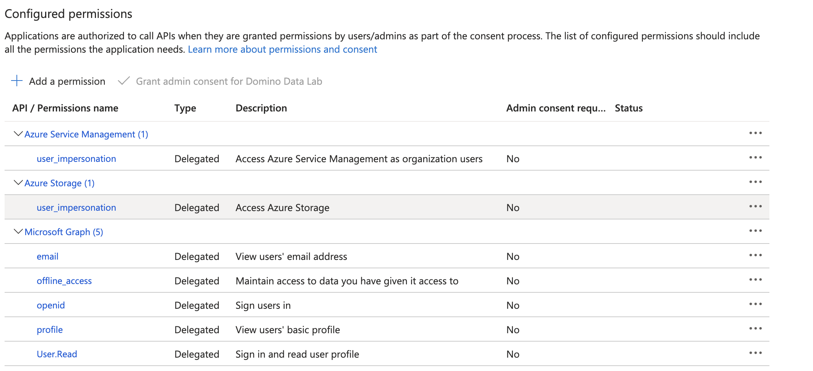
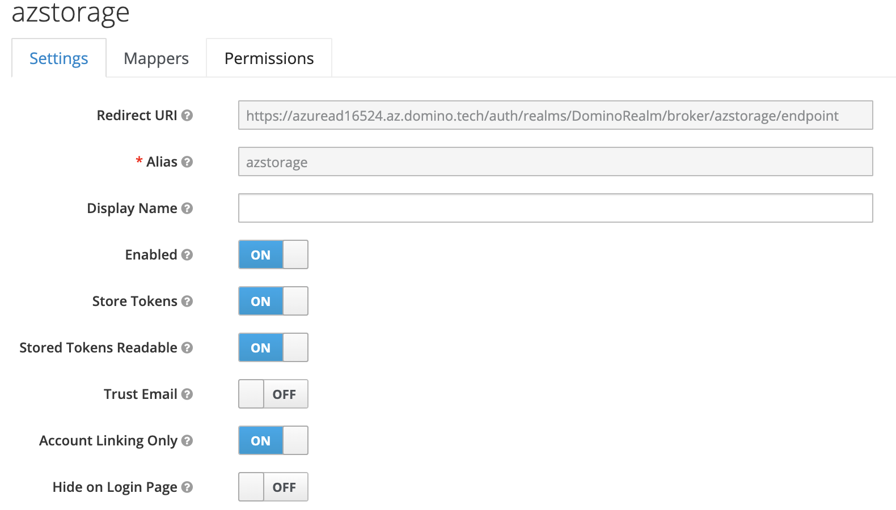
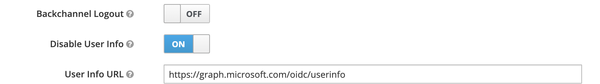
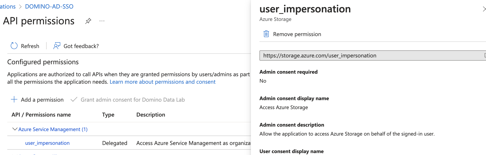
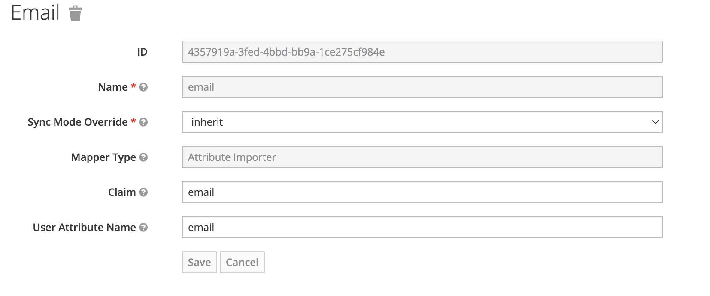
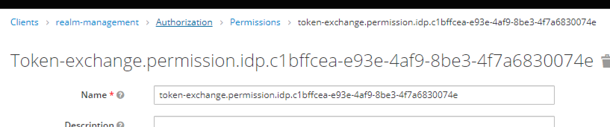
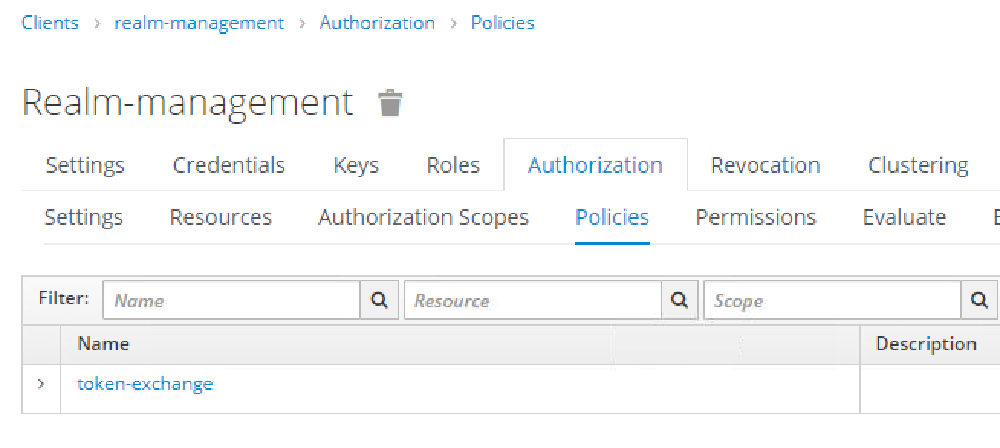

# 🕊️  Self Paced Enablement for configuring Azure Cred Prop for your own Domino 🕊️

## Requirements

 - A Domino cluster, running anywhere
 - A login for our azure tenant
 - Access to our eng-platform azure cloud subscription (requested via CRE ticket)
 - Ideally have run [Azure SSO setup](../README.md) to create & configure an azure application for OIDC SSO with Domino

## Keycloak Configuration

Keycloak requires some extra configuration to enable the token exchange features:

Option 1:
```
kubectl edit cm -n domino-platform keycloak-sh

Add -Dkeycloak.profile.feature.token_exchange=enabled -Dkeycloak.profile.feature.admin_fine_grained_authz=enabled

kubectl rollout restart -n domino-platform sts/keycloakv18

kubectl rollout status -n domino-platform sts/keycloakv18
```

Option 2:
Add the following release overrides to the domino install yaml:

```
release_overrides:
  keycloak:
    chart_values:
      extraArgs: "-Dkeycloak.profile.feature.token_exchange=enabled -Dkeycloak.profile.feature.admin_fine_grained_authz=enabled"
```

## IDP setup


Follow the steps from [Azure SSO setup](../README.md) to setup your Azure Application, then create a new IDP in keycloak following the OIDC steps, with these changes:

 1. In your Azure App under Api permissions, add permissions for the target azure resource you want to connect to (this example will use storage):
 

 2. Set “Account Linking Only” to ON

    
 3. Set “Disable user info” to ON

    
 4. Set “Default scopes” to “offline_access https://storage.azure.com/user_impersonation” (the second scope should match your target API from azure in step 1)

     

 5. Add a new mapper as defined below: If you're using azure SSO from the same application, then this is the only mapper you require (keycloak will match users between the 2 IDPs based on email address)

    

Using OIDC for the normal domino SSO is optional, and in general SSO itself is optional - the only requirement is that the email address returned by Azure is the same as the email used by the logged in user.


## Token Exchange permissions

Follow the [Keycloak Documentation](https://www.keycloak.org/docs/latest/securing_apps/#internal-token-to-external-token-exchange) to setup the permissions for Internal-External token exchange between the domino-play client in Keycloak and your newly created IDP. 

Docs show a different UI, so for step 3 from the keycloak docs `Click Client details in the breadcrumbs at the top of the screen.`,  click on ‘Authorization’ under realm-mgmt, then ‘Policies’ to create a new policy





## Token exchange in tooling-jwt container

We have [DOM-49679](https://dominodatalab.atlassian.net/browse/DOM-49679) pending for merge with the Product team. 

If this has not yet been merged in your target version, we need to install [Domsed](../../domsed/README.md), then take the following steps:

 1. Checkout https://github.com/cerebrotech/domino-credential-propagation/pull/108/files

 2. Rebase your local copy on the target cred-prop version for your environment - version will be the credentials-propagator image version from https://github.com/cerebrotech/platform-apps/releases, under the image json in the release artefacts. Alternatively, just check the version being used in the target environment

 3. Download the 3 changed files after rebasing: 

```
credentials_propagation/jwt/jwt_refresher.py
credentials_propagation/proxy/token_endpoint.py
credentials_propagation/proxy/authenticating_reverse_proxy.py
```

 4. In the target environment, create a CM with these 3 files:

```
kubectl -n domino-compute create cm creds-override --from-file=jwt_refresher.py=./credentials_propagation/jwt/jwt_refresher.py --from-file=token_endpoint.py=./credentials_propagation/proxy/token_endpoint.py --from-file=authenticating_reverse_proxy.py=./credentials_propagation/proxy/authenticating_reverse_proxy.py
```

 5. Apply the Domsed mutation:

```
rules:
- insertVolumes:
  - configMap:
      name: creds-override
    name: creds-override
- insertVolumeMounts:
    containerSelector:
    - tooling-jwt
    volumeMounts:
    - mountPath: /app/credentials_propagation/jwt/jwt_refresher.py
      name: creds-override
      subPath: jwt_refresher.py
    - mountPath: /app/credentials_propagation/proxy/token_endpoint.py
      name: creds-override
      subPath: token_endpoint.py
    - mountPath: /app/credentials_propagation/proxy/authenticating_reverse_proxy.py
      name: creds-override
      subPath: authenticating_reverse_proxy.py
```

## Test from within a workspace

Pip install  #TODO: mirrors link for aad package(https://github.com/cerebrotech/domino_aad) into your workspace/compute environment

Run the code below. Replace ‘azstorage’ with the name of the IDP created in keycloak, and the 'account_url' must be for an azure account where your user has access. 

```
from domino_aad import DominoCredential
from azure.storage.blob import BlobServiceClient


account_url = f'https://xxxx.blob.core.windows.net'

# 'azstorage' is as per the keycloak configuration for the local environment
# Input will be different for different APIs (blobs, datalake, mysql etc)
creds = DominoCredential("azstorage")

blob_service_client = BlobServiceClient(account_url, credential=creds)

[print(container) for container in blob_service_client.list_containers(include_metadata=True)]
```

The first time you run this, the API will return a URL instead of a token. Click this URL, which will redirect you to Azure for allowing access. Once the access is granted, you can come back to the workspace and just hit Enter to continue

The example here is for Blobs, but the same DominoCredential can be passed to any azure python SDK that accepts TokenCredential. The service you call must match the scope you selected in your IDP

