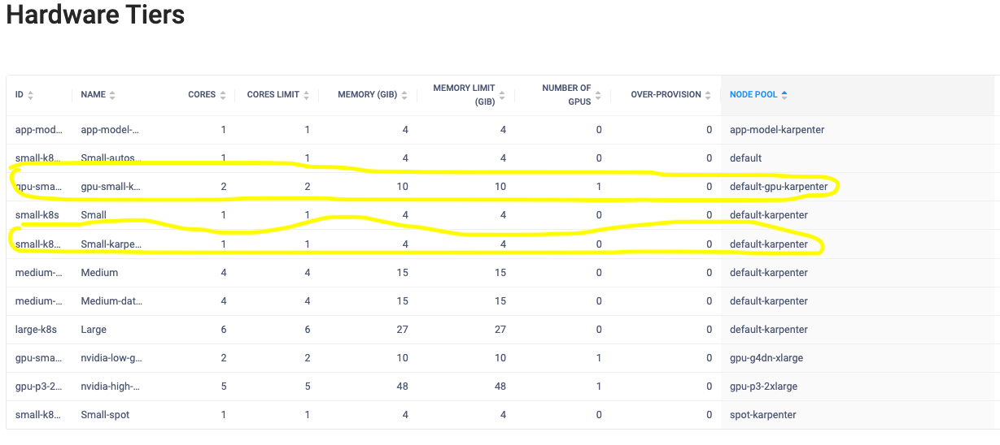

# ddl-field Karpenter scripts and configuration

This repository contains the Karpenter configuration files 

- karpenter deployment configuration
- provisioner definitions

and deployment scripts

- shell scripts
- terraform  code for IAM policy configuration

Documentation - https://dominodatalab.atlassian.net/wiki/spaces/~621e9b524160640069c62b24/pages/2498986039/Enable+Karpenter+In+Prod+Field

## Prerequisites

- AWS CLI - https://docs.aws.amazon.com/cli/latest/userguide/getting-started-install.html
- Kubectl - https://kubernetes.io/docs/tasks/tools/install-kubectl-linux/
- Helm - https://helm.sh/docs/helm/helm_install/
- Terraform - https://developer.hashicorp.com/terraform/tutorials/aws-get-started/install-cli
- Domino instance with Kubernetes access
- AWS account where Domino is deployed with admin access to configure IAM policies.

## Install Process
- make sure you have your AWS CLI working with proper credentails.

- execute the terraform to turn on the IAM OIDC provider, create IAM policies and roles.

**Review the changes first**


```
cd terraform
terraform plan
```

**Apply the changes**

```
cd terraform
terraform apply -auto-approve
```
- Update the aws-auth config map

```
kubectl edit configmap aws-auth -n kube-system
```
You will need to add a section to the mapRoles that looks something like this. Replace the ${AWS_ACCOUNT_ID} variable with your account, but do not replace the {{EC2PrivateDNSName}}.

```
    - groups:
      - system:bootstrappers
      - system:nodes
      rolearn: arn:aws:iam::${AWS_ACCOUNT_ID}:role/KarpenterInstanceNodeRole
      username: system:node:{{EC2PrivateDNSName}}

```      
Example line that needs to be added to the config map,
```
{"rolearn":"arn:aws:iam::946429944765:role/KarpenterInstanceNodeRole-ddl-field","username":"system:node:{{EC2PrivateDNSName}}","groups":["system:bootstrappers","system:nodes"]}
```

- Apply the pod security policies and cluster role bindings to the Kubernetes cluster.

```
cd configs
kubectl apply -f new-psp.yaml
kubectl apply -f new-clusterrole-binding.yaml
```

- Deploy the Karpenter using the helm template configs/kerpenter.yaml

Execute the following script

```
scripts/deploy-karpenter.sh
```

- Configure the provisioners
```
kubectl apply -f default-provisioner.yaml
```


## Remove karpenter

Execute the delete script
```
scripts/delete-karpenter.sh
```

## Deploy the Karpenter provisioners
Once the Karpenter is deployed successfully, deploy the provisioners to match Domino Hardware tiers. The following provisions are examples.

- Default provisioner

This is the default provisioner for small, medium, and large hardware tiers based on M-type instances.

[default-provisioner.yaml](configs/default-provisioner.yaml)

- GPU provisioner for P3 

This is the provisioner for the GPU hardware tier that requires P3 instance types.

[gpu-p3-provisioner.yaml](configs/gpu-p3-provisioner.yaml)

- GPU provisioner for G4

This is the provisioner for the GPU hardware tier that requires G4 instance types.

[gpu-provisioner.yaml ](configs/gpu-provisioner.yaml) 

- Spot provisioner for APPs and Model APIs

This is the provisioner for Model API and APP pods that can use spot instances and can be consolidated.

[spot-provisioner.yaml](configs/spot-provisioner.yaml)


## Verify Karpenter Functionality
**Note**
 that Karpenter provisioners will act on any pod creation requests that are outstanding or waiting due to not matching the cluster auto scaler requirements.

The easiest way to test the Karepenter functionality without affecting the cluster auto scaler is to create nonexistent node pools for the test Domino Hardware tiers. 

When a run is created with this hardware tier, the cluster auto scaler won't handle the request since there is no existing node pool. Then this request will be picked up by the Karepenter provisioners. 

The following example shows the small-karpenter and gpu-small-karpenter hardware tiers used to validate the functionality of small and GPU hardware tiers. 



They are both referring to non-existent node pools in AWS. However, the Karpenter provisioner has the following to match the request to the correct provisioner.


```
- key: dominodatalab.com/node-pool
      operator: In
      values: ["default-karpenter"]
```

## Disable the Cluster Auto Scaler (optional)
Once all existing hardware tiers have been migrated to Karpenter provisioners, the cluster auto scaler can be disabled by scaling down the deployment. 

```
kubectl scale deploy/cluster-autoscaler -n kube-system --replicas=0
```

